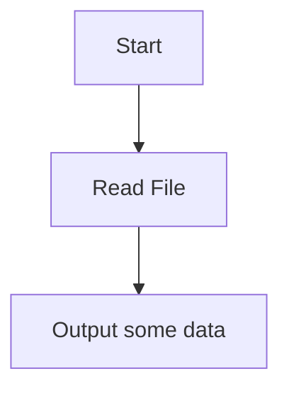

# Fundamentals of Computing - Assignment

## Student Information

**Name:** Joseph Adams
**Student ID:** 2411484

## Project Information

This repository will contains the code and data used to produce the assignment for the 'Fundamentals of Computing' module.

The basic premise is to use data from Kaggle, in this case UK Accident data, to show which dates were most prone to accidents. This may be accomplished by outputting to the console, or time permitting some visual means may be possible.

The data in question is coming from [this link](https://www.kaggle.com/code/khawlabenghalia/uk-accident) - it should be noted there were multiple data sources for Accident Data.

This readme will be updated as new sections of code or decisions are added.

## Warning

I had a helluva time with windows and dependancies - they kept installing to a default binary location, which wasn't the one I wanted. I have tried to follow practices and have a requirements.txt file which has the dependancies, but I really don't know if it will work. I have seen that you would use `pip install -r requirements.txt` to install, but I've not tried it. I assume someone more up to speed with Python knows how to do this.

## Program flow

At the moment, the script does not do much. It will read the data in, converting each row to a tuple, and then print out a single row, and the line count. The file has **307974** rows, but we print a count of **307973** due to the header row being stripped out.

Tuples are used as they are immutable, slightly more memory-efficient (not a huge concern for this dataset.)

## Current state

- Presently the data is read from the file, it is then processed for 3 dropdowns and filtered to avoid selecting an invalid combination.
- Once the selections have been done, the graph is plotted with matplotlib.
- UI is not my expertise (in Python) so this feels a bit "bitty".

## Future work

~~- Investigate Python's GUI libraries - this sort of tool would benefit from having a GUI rather a text interface.~~
~~- The GUI needs to be cross-platform~~

- Revist the data - depending on the GUI tool the data may need reformatting, it would certainly benefit from aggregating data - **not needed**.
- At the moment we are looking at file based data - this could be changed to pull the data from Kaggle direct
  ~~- The data is working well as a tuple, Qt is populating dropdowns based on the data - however, we could end up with users selecting data which does not exist. Need to look at cascading drop downs (Year -> Police -> Local Auth - > Search)~~
- Look at adding a heatmap - if QT can support tabs (I mean, it should, right?) - it would be another way to visualise the data.
