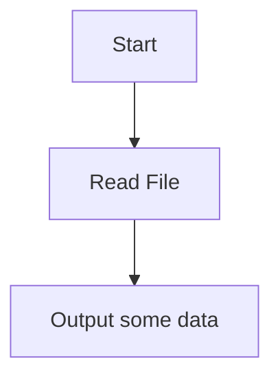

# Fundamentals of Computing - Assignment

## Student Information

**Name:** Joseph Adams
**Student ID:** 2411484

## Project Information

This repository will contains the code and data used to produce the assignment for the 'Fundamentals of Computing' module.

The basic premise is to use data from Kaggle, in this case UK Accident data, to show which dates were most prone to accidents. This may be accomplished by outputting to the console, or time permitting some visual means may be possible.

The data in question is coming from [this link](https://www.kaggle.com/code/khawlabenghalia/uk-accident) - it should be noted there were multiple data sources for Accident Data.

This readme will be updated as new sections of code or decisions are added.

## Program flow

At the moment, the script does not do much. It will read the data in, converting each row to a tuple, and then print out a single row, and the line count. The file has **307974** rows, but we print a count of **307973** due to the header row being stripped out.

Tuples are used as they are immutable, slightly more memory-efficient (not a huge concern for this dataset.)

## Future work

- Investigate Python's GUI libraries - this sort of tool would benefit from having a GUI rather a text interface.
  - The GUI needs to be cross-platform
- Revist the data - depending on the GUI tool the data may need reformatting, it would certainly benefit from aggregating data.
- At the moment we are looking at file based data - this could be changed to pull the data from Kaggle direct
